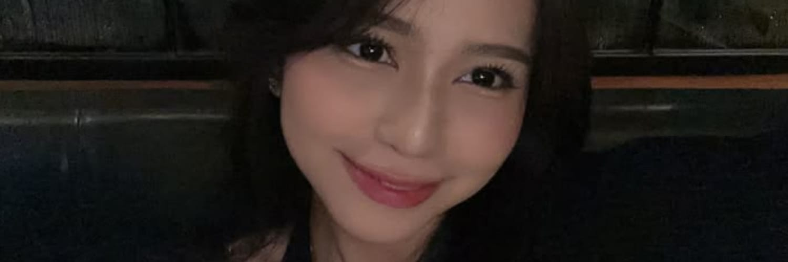

# Hi there! 👋 I'm Hasan Fadhli

> *Information Technology Student | AI Engineer | Data Scientist | Machine Learning Enthusiast*

## 🚀 About Me

I'm a passionate Information Technology student at Universitas Tidar with a deep fascination for **artificial intelligence** and **data science**. Currently immersing myself in the transformative worlds of **machine learning**, **deep learning**, and **data analytics**.

What drives me? **Innovation** and the excitement of solving real-world problems through intelligent systems. Whether it's building predictive models, developing computer vision applications, or extracting meaningful insights from complex datasets, I'm constantly pushing the boundaries of what's possible with AI.

🎯 **Currently seeking**: AI/ML internship opportunities, research collaborations, and connections with fellow data scientists and AI practitioners!

---

## 🛠️ Tech Stack

### 🤖 AI & Machine Learning

  

### 📊 Data Science & Analytics

  

### ☁️ Cloud & MLOps

  

### 🛠️ Tools & IDE

  

**Additional Tools:** Pandas, NumPy, Scikit-learn, Matplotlib, Seaborn, Plotly, Streamlit, FastAPI, Apache Spark, Tableau, Power BI

---

## 🌱 What I'm Currently Working On

- 🧠 **Developing advanced neural networks** for natural language processing and computer vision
- 📈 **Building end-to-end ML pipelines** from data collection to model deployment
- 🔍 **Exploring cutting-edge AI research** in transformer architectures and generative models
- 📊 **Creating interactive data visualizations** and business intelligence dashboards
- 🤝 **Contributing to open-source AI projects** and sharing knowledge with the community

---

## 🎯 Areas of Expertise

- **Machine Learning**: Supervised/Unsupervised Learning, Ensemble Methods, Feature Engineering
- **Deep Learning**: CNNs, RNNs, Transformers, GANs, Transfer Learning
- **Computer Vision**: Image Classification, Object Detection, Image Segmentation
- **Natural Language Processing**: Text Analysis, Sentiment Analysis, Language Models
- **Data Engineering**: ETL Pipelines, Data Warehousing, Big Data Processing
- **MLOps**: Model Deployment, Monitoring, CI/CD for ML, Containerization

---

## 📊 GitHub Stats

  
  

  
  

  

---

## 🐍 Contribution Snake

  

---

## 🎵 Currently Listening To

  

---

## 🚀 Featured Projects

### 🔍 [AI Project Portfolio]
- **Smart Recommendation System**: Built using collaborative filtering and deep learning
- **Computer Vision Pipeline**: Real-time object detection and classification system
- **NLP Sentiment Analyzer**: Multi-language sentiment analysis with transformer models
- **Predictive Analytics Dashboard**: Interactive ML-powered business intelligence tool

---

## 🤝 Let's Connect!

I'm always excited to discuss AI innovations, collaborate on machine learning projects, contribute to research initiatives, and explore the future of artificial intelligence!

**Currently open for AI/ML internships** and ready to bring cutting-edge solutions and passionate dedication to your team!

  
  
  
  
  

---

  <i>"In the age of AI, data is the new oil, and intelligent algorithms are the engines of tomorrow!"</i>
  
  **Thanks for visiting! Let's build the future with AI together! 🤖✨**

